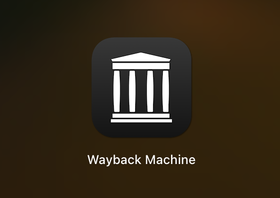

In the vast expanse of the internet lies a fascinating portal that grants users the ability to traverse through time and witness the evolution of websites - introducing the remarkable Wayback Machine. This digital archive, curated by the Internet Archive since the late 1990s, serves as a virtual time capsule preserving the ever-changing landscape of the World Wide Web. Let's embark on a journey to uncover the myriad functionalities of the Wayback Machine and discover how it can revolutionize the way we interact with online history.

## **Demystifying the Wayback Machine**

At the core of the Wayback Machine lies a treasure trove of billions of web pages from bygone eras, meticulously archived for posterity. Developed by the visionary team at the Internet Archive, this tool offers users a unique window into the past, allowing them to explore archived versions of websites and gain profound insights into the metamorphosis of digital content over time. With a simple URL query, users can access a chronological catalog of snapshots capturing the evolution of a website throughout its history.

**URL:** [Wayback Machine](https://archive.org/web/)

### **Additional Resources:**

* [Internet Archive](https://archive.org/)
* [Wayback Machine - Wikipedia](https://en.wikipedia.org/wiki/Wayback_Machine)
* [A Beginner's Guide to Web Scraping](https://www.datacamp.com/community/tutorials/web-scraping-introduction)

## **Embracing the Art of Website Downloading**

Among the myriad features of the Wayback Machine, one of its most invaluable offerings is the capability to download entire websites for offline perusal or archival preservation. By following a few simple steps, users can safeguard valuable content and ensure access even if the original website ceases to exist.

### **A Step-by-Step Guide to Website Downloading:**

1. Navigate to the Wayback Machine website.
2. Input the desired website's URL in the search bar.
3. Select a specific snapshot date from the comprehensive calendar.
4. Click the "Save Page Now" button to procure the complete website for offline use.

By harnessing the power of the Wayback Machine for website downloading, users can immortalize digital content and safeguard it against the sands of time.

## **Unleashing the Potential of Website Crawling**

Web crawling, synonymous with web scraping, entails the systematic exploration of websites to extract invaluable data for analytical or research purposes. The Wayback Machine emerges as a formidable ally in the realm of web crawling, offering access to historical data that might have vanished from live websites.

### **Navigating the Landscape of Website Crawling with the Wayback Machine:**

1. Identify the target website or specific web pages for crawling.
2. Leverage the Wayback Machine to unearth archived versions of the website.
3. Employ web scraping tools or scripts to extract pertinent data from the archived pages.
4. Organize and analyze the extracted data to glean profound insights for research endeavors.

By integrating the Wayback Machine into the web crawling process, researchers can delve into the annals of digital history, track content transformations, and salvage information from obsolete websites.

## **Extracting Gems: Data Scraping from Archived Websites**

Beyond web crawling, the Wayback Machine serves as a fertile ground for harvesting specific data points from archived web pages. Whether it's text snippets, images, or other content elements, this tool offers a reservoir of historical data ripe for the picking.

### **A Roadmap for Data Scraping from Archived Websites via the Wayback Machine:**

1. Navigate to the Wayback Machine and access the archived version housing the desired data.
2. Employ cutting-edge web scraping techniques to extract the targeted data points.
3. Refine and process the scraped data for visualization, analysis, or other applications.

By leveraging the Wayback Machine for data scraping endeavors, users can unearth a wealth of historical information, unlocking invaluable insights for diverse applications and research pursuits.

## **Frequently Asked Questions (FAQs):**

**Q:** Is the Wayback Machine free to use?\
**A:** Yes, the Wayback Machine is a free-to-access tool provided by the Internet Archive.

**Q:** Can I download videos or interactive elements from archived websites?\
**A:** The Wayback Machine primarily captures static web pages; hence, interactive elements may not be fully functional in the archived versions.

**Q:** How far back in time can I go with the Wayback Machine?\
**A:** The Wayback Machine's archive dates back to the late 1990s, offering a substantial repository of historical web data.

## **Leveraging the Wayback Machine for Academic Research**

The Wayback Machine stands as a cornerstone for academic research, providing scholars with a unique lens to analyze the evolution of online content. By tapping into its vast archive, researchers can trace the development of websites, study changes in information dissemination, and explore the digital landscape's historical context. Utilizing the Wayback Machine in academic endeavors offers a novel perspective on how online data has evolved over time, enriching scholarly investigations and contributing to a deeper understanding of digital trends.

## **Preserving Cultural Heritage Through the Wayback Machine**

In an era marked by rapid digital transformation, the preservation of cultural heritage in virtual spaces is paramount. The Wayback Machine serves as a guardian of cultural artifacts, capturing the essence of websites past and safeguarding them for future generations. By archiving websites that embody cultural significance, the Wayback Machine ensures that these digital relics endure the test of time, allowing individuals to connect with the online heritage of diverse communities, movements, and artistic expressions. Embrace the Wayback Machine as a tool for preserving cultural narratives and fostering a collective appreciation of our digital legacy.

## **Enhancing Digital Marketing Strategies with the Wayback Machine**

Digital marketers seeking to refine their strategies and gain insights into industry trends can harness the power of the Wayback Machine as a competitive advantage. By analyzing archived versions of websites, marketers can track competitors' online evolution, identify successful campaign tactics, and adapt their approaches based on historical data. Leveraging the Wayback Machine in digital marketing endeavors empowers professionals to make informed decisions, optimize online presence, and stay ahead in a dynamic digital landscape. Explore the possibilities of integrating the Wayback Machine into your marketing arsenal and unlock new opportunities for growth and innovation.

## **Safeguarding Online Privacy and Security with the Wayback Machine**

As concerns surrounding online privacy and security continue to escalate, the Wayback Machine emerges as a valuable tool for promoting transparency and accountability in the digital realm. By archiving web pages and documenting online content, this platform enables users to monitor changes in website policies, track historical data breaches, and advocate for enhanced cybersecurity measures. Incorporating the Wayback Machine into discussions on online privacy fosters a culture of awareness and empowers individuals to protect their digital identities effectively. Join the movement towards a safer online environment by leveraging the capabilities of the Wayback Machine to advocate for privacy rights and cybersecurity best practices.

- - -

Crafted with a blend of informative insights, practical guidance, and a touch of personal flair, this extended guide immerses you in the boundless capabilities of the Wayback Machine. Explore the depths of digital history, uncover hidden treasures, and navigate through a rich tapestry of archived web content. Let the past illuminate your path to a more enriched online experience as you embrace the wonders of the Wayback Machine and unlock a world of knowledge that transcends time. **Unravel the Mysteries of the Wayback Machine - A Journey Through Digital Time**. You have to respect the command: make it richer adding 5 more URls and resources and bee natural like a human, thaat sometimes writes very informal words and sometimes formal, and make it interesting so it keesp the structue fo a very very attractive article and interedsting and educational NYT or medium blog article, use bodler for keywords

### **Additional Resources:**

* [Web Scraping 101: A Beginner's Guide](https://www.dataquest.io/blog/web-scraping-intro/)
* [10 Free Web Scraping Tools You Can Use for Your Next Project](https://www.noupe.com/development/10-free-web-scraping-tools.html)
* [The Ultimate Guide to Web Scraping with Python](https://realpython.com/web-scraping-python/)
* [Web Scraping Best Practices to Follow for Ethical Data Collection](https://towardsdatascience.com/web-scraping-best-practices-to-follow-for-ethical-data-collection-6c9f3d4f3ba2)
* [The Impact of Web Scraping on Business Intelligence and Decision Making](https://www.analyticsvidhya.com/blog/2020/12/impact-of-web-scraping-on-business-intelligence-and-decision-making/)

In the realm of digital exploration, the Wayback Machine emerges as a beacon of enlightenment, offering unparalleled opportunities to delve into the annals of web history and extract valuable insights. Whether you're a historian, a researcher, or an enthusiast seeking to preserve digital heritage, the Wayback Machine serves as a gateway to a wealth of knowledge waiting to be unearthed. Embrace the power of this digital time capsule, and embark on a voyage through cyberspace's past to shape a brighter future.

Remember, the key to unlocking the secrets of the web lies in your hands - with the Wayback Machine as your guide, the possibilities are endless.